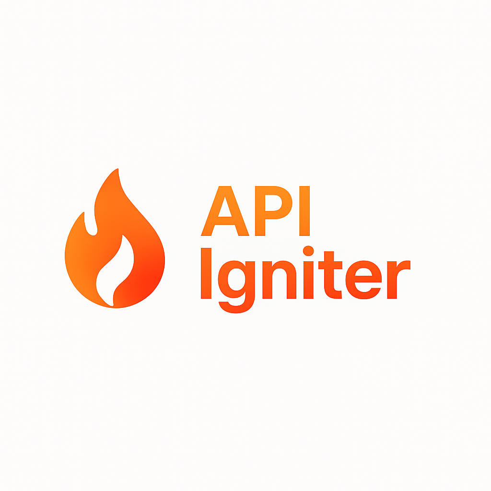

  

  

# About Api Igniter

Laravel package designed to power up your API development with clean, consistent, and customizable responses out of the box.

## 🚀 Features

### ✅ Filtering, Sorting & Pagination

Easily apply filters, sorting, and pagination to your API responses using expressive, intuitive syntax.

### 🔗 Relationship Link Expansion

Allow clients to expand related resources directly within the response by including embedded representations instead of (or alongside) hyperlinks.

### 🧬 Field Projections

Support for field selection (aka sparse fieldsets), enabling clients to request only the fields they need — keeping payloads lean and fast.

⸻
